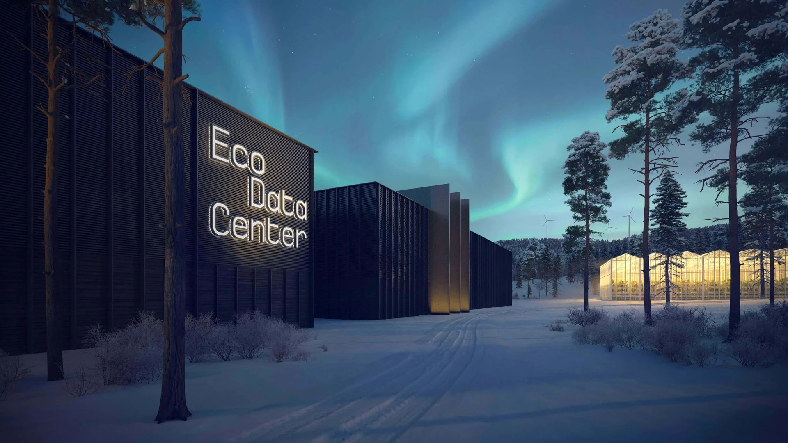
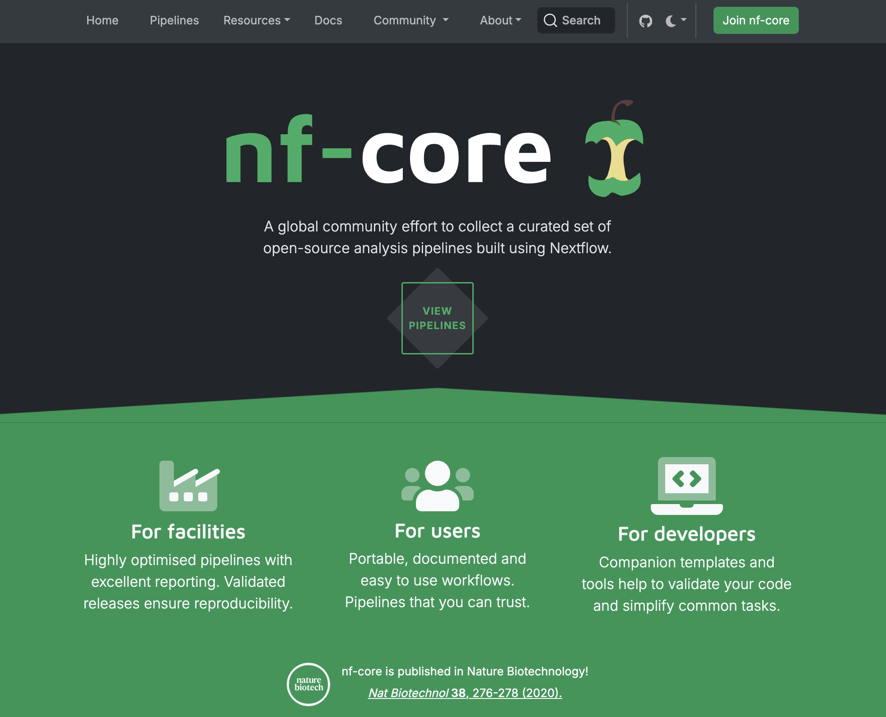
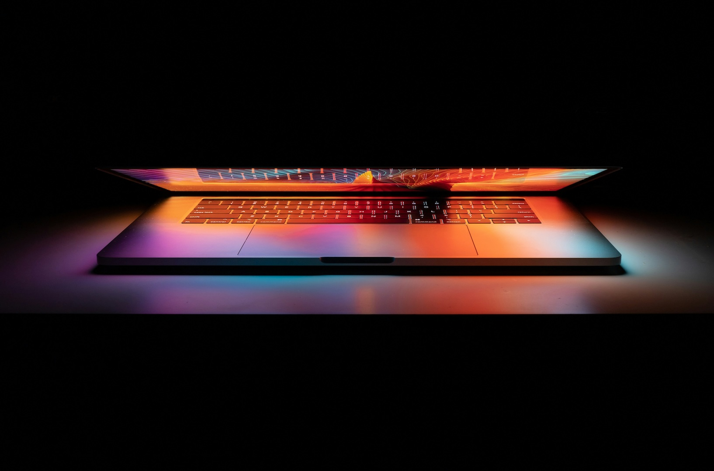
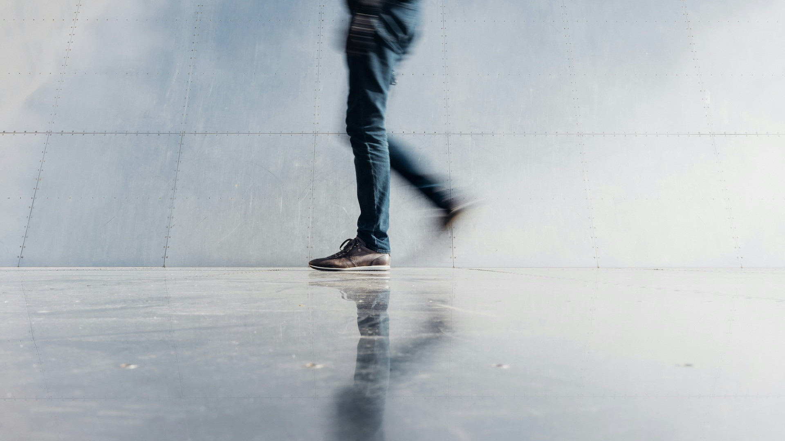
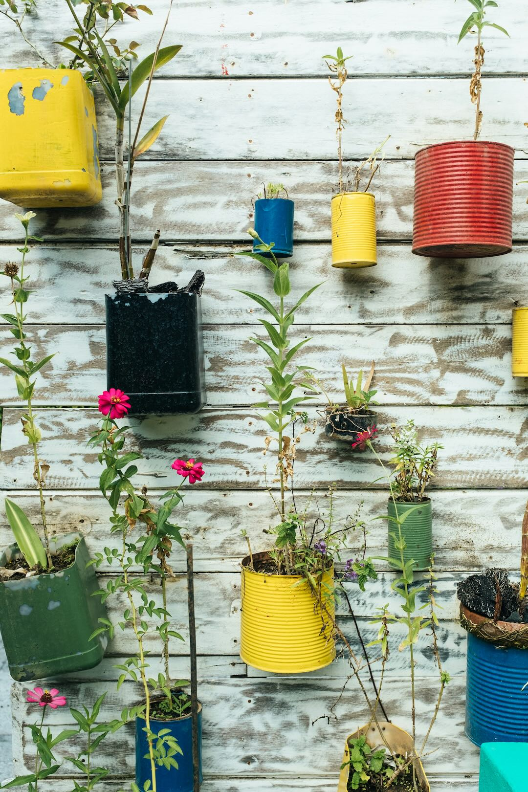

## Sustainability in the Technology Facility Data Science Hub

As a group that works in a purely digital manner, we escape some of the less sustainable aspects of wet lab research, but we should recognise that the digital research we do still has significant impacts in terms of sustainability and the environment. This short induction pack on sustainability covers some of the ways that we are aiming to lessen the negative impacts our work has.

## Sustainability Statement

Our group's [Sustainability Statement](assets/sustainability/sustainability-statement-2025.pdf) gives a good overview of how we are tackling sustainability. Please read through the statement and get familiar with it. Do ask one of us if anything is unclear or requires more explanation.

## Top Impacts Document

Our [Top Impacts document](assets/sustainability/top-impacts-2025.pdf) lays out the top five positive and negative impacts that our work has in terms of sustainability, expanding upon our Sustainbility Statement and picking out the key focus points. Please familiarise yourself with it.

## Digital Carbon Footprint

Being a group that works digitally, our digital carbon footprint comprises a large portion of our total carbon footprint. We'll briefly cover some of the key areas of sustainable digital work that can make a difference in terms of our digital carbon footprint.

### Eco-minded High Performance Computing

High Performance Computing (HPC), by its nature, produces a significant carbon footprint including the hardware, the data centre infrastructure, the electricity consumed, water used for cooling, and more.

In our group, we use the Viking 2 HPC facility, hosted at the EcoDataCenter in Sweden, for a majority of our work. Viking 2 allows us to run large-scale data analysis tasks quickly and efficiently. The EcoDataCenter was specifically chosen for its more eco-minded credentials when going through the process of tender for the original Viking's replacement.

[You can learn more about Viking 2 here.](https://vikingdocs.york.ac.uk/index.html)

EcoDataCenter is run on 100% renewable power (from wind and hydroelectric). The data centre itself is built from wood a lighter and more efficient material than steel and/or concrete. Surplus energy from the data centre is recycled into a nearby thermal power plant and used to produce wood pellets, a clean source of energy.

[You can learn more about EcoDataCenter here.](https://ecodatacenter.tech/data-center/ecodatacenter-1)

### Efficient Analysis Pipelines

As much as possible, we are trying to run our data through more efficient pipelines which should be less prone to failing, more efficient in terms of resources consumed, and requiring less human intervention from us.

We are using [nf-core](https://nf-co.re/) pipelines, a set of community built and best-practice pipelines for common tasks like RNA-seq analysis. These pipelines are built on top of the [NextFlow pipeline architecture](https://www.nextflow.io/).

These nf-core pipelines are run on Viking 2 using a system called the [Seqera Platform](https://seqera.io/platform/), which allows you to configure, start, and monitor pipeline runs in your web browser.

### Efficient Data Storage and Data Sharing

We encourage group members to be conscious of avoiding needless duplication of the same data in several different places, or sending data via email when a link to the data on a cloud storage platform (like the University's Google Drive storage) or networked file server could be more efficient.

The ultimate location of all raw data and results generated from that raw data should be in our backed-up "tfds" location on `storage.york.ac.uk`. Once data is safely stored there, it should be deleted from Viking scratch and/or copies on your local machine. Appropriate people can then be given access to their data on `storage.york.ac.uk`.

We can advise on how to transfer data to and from `storage.york.ac.uk` and how to grant folder access to others.

### Energy-saving Settings

One method of saving energy, and hence reducing our digital carbon footprint, is to set the energy-saving settings on our workstations appropriately. You should:

* Set your screen brightness is set to a comfortably low level
* Use dark mode on your devices if possible (it's more efficient)
* Set your display and computer to sleep after a reasonably short time
* Turn off your computer and monitor at night, weekends, and holidays

### The Ecosia Search Engine

We would encourage group members to use the [Ecosia search engine](https://www.ecosia.org/) as their default search. Ecosia donate all profits to climate-related causes such as tree-planting or solar power.

## Personal Carbon Footprint

As well as the carbon footprint of our digital work, there are many other personal actions that we take that impact on our total carbon footprint, and ways that we can lessen that impact.

### Travel

Travel to and from work (commuting) and other work-related travel, e.g. attending conferences or meetings, can be a significant source of carbon emissions. Car and air travel are especially bad for this.

Where possible, walking and cycling to and from work are an especially good form of travel with minimal environmental impact. Public transport by bus or train has a lower impact than travelling by car, and the University offers [interest-free travel loans](https://www.york.ac.uk/admin/hr/employee-benefits/selection/introduction/) (that can be paid back through salary sacrifice) to pay for season tickets. They also operate a [Cycle to Work scheme](https://www.york.ac.uk/staff/news/2020/cycletoworkscheme/) that offers discounted bikes and equipment, also through the salary sacrifice scheme.

[More information on sustainable travel at the University is available here.](https://www.york.ac.uk/about/sustainability/general-guidance/sustainable-travel/)

When travelling to conferences or meetings, we would encourage you to think about whether you can attend virtually and thus save travelling. If you need to travel, then we would encourage rail travel which can be faster and less impactful than travelling by car, and signficantly better than air travel.

Hybrid working (i.e. working from home one or more days) is something that is much easier for us, due to our purely digital workflow, and saves travelling to and from the University as frequently. This is something that can be discussed with your group leader or line manager.

### Lighting, Heating, and Cooling

Office lighting, heating, and cooling have impacts on our personal carbon footprints, but these can be minimised.

Our office has abundant natural light, especially in the afternoons, and we would encourage you to make use of this whenever possible and to turn the room lights off.

The Biology Department has a building management system that manages the temperature of its buildings, and turns off boilers and air conditioning in most areas at night, at weekends, and during holidays. However, our office also has radiators with thermostatic valves to further regulate the temperature. These thermostats should be set to a sensible level to keep the office at a comfortable level when heating is necessary.

Our office does not have air conditioning to cool it, but the windows and blinds can be opened/closed to help cool the room.

### Electrical Devices

Electrical devices and sockets should be turned off whenever possible, but especially at the weekends and during holidays.

There is an Energy Saving Checklist on the back of the door to remind you of this, and a detailed [Lighting and Equipment Plan here](assets/sustainability/lighting-and-equipment-plan.pdf) (also displayed on our office notice board).

### Reduce, Reuse, and Recycle

We should aim to reduce our waste as much as possble, by using products that have less packaging or more recyclable packaging, and those products with a longer lifetime.

We can reduce our use of disposable food cups and containers by using refillable bottles and cups, and making use of the University's [YORCUPs](https://www.york.ac.uk/eat-drink-shop/eat-drink/sustainability/yorcup/) which can be bought from campus catering outlets for a one-off charge and then swapped for a clean one whenever you need.

Rather than disposing of items, whether they be electrical items or other items such as food, we should try to reuse them if possible. 

Companies like Apple will take back their products and recycle as many of the materials as possible, and will usually also give you a resultant discount towards new devices. There is a table right outside our B/F002 office where items can be left for others to claim and reuse, and the University has a [Warp It Portal](https://www.warp-it.co.uk/company/UniofYork) for items to be reused by others rather than being discarded.

The Biology Department encourages leftover catering from events to be left in the atrium for others, rather than being wasted, and emails will often go out to the departmental email list to alert staff and students. Campus catering outlets (like Cookies in Biology) will often give away leftover food shortly before closing, so it's worth a visit, especially on Friday afternoons.

We should try to recycle as much as possible, making use of the many "mixed use" recycling bins (one is directly opposite our office) and food waste bins (in the kitchen opposite our office). These will usually be labelled with what can and can't go in them, and [more information can be found here on recycling and waste](https://www.york.ac.uk/about/sustainability/general-guidance/recycling-and-waste/recycling-waste-guide/).

## Promoting Sustainability

As a group, we should try to promote sustainability and our work in that area as much as possible. This could be as simple as a one-minute slide at the end of a presentation with an overview of our efforts in sustainability, a link to our Sustainability Statement or Green Impact award logo in your email signature, or incorporating sustainable behaviour into your life outside work.